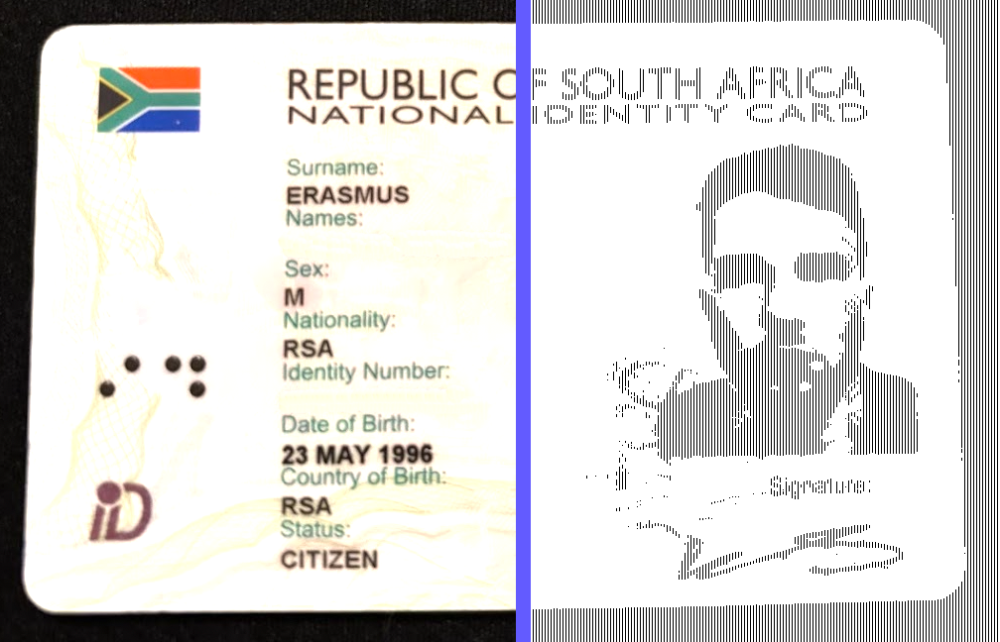

<h3 align="center">Get Verified</h3>

<p align="center">
    South Africa's first open-source digital verification platform
    <br />
    <a href="https://getverified.co.za"><strong>Learn more »</strong></a>
    <br />
    <br />
    <a href="#introduction"><strong>Introduction</strong></a> ·
    <a href="#features"><strong>Features</strong></a> ·
    <a href="#contributing"><strong>Contributing</strong></a>
</p>

<p align="center">
  <a href="https://github.com/getverifiedhq/get-verified/blob/main/LICENSE.md">
    
  </a>
</p>

<br/>

## Introduction

Get Verified is the open-source digital identity verification platform for South Africa.



```json
{
  "surname": "Smith",
  "names": "John",
  "sex": "M",
  "nationality": "RSA",
  "identity_number": "9605231234567",
  "date_of_birth": "1996-05-23",
  "country_of_birth": "RSA",
  "status": "CITIZEN"
}
```

## Features

- **Free custom domains**: Create branded short links [with your own domain](https://dub.co/help/article/how-to-add-custom-domain) and [improve click-through rates by 30%](https://dub.co/blog/custom-domains). Paid plans also include a [complimentary custom domain](https://dub.co/help/article/free-dot-link-domain).
- **Advanced link features**: Supercharge your links with [custom link previews](https://dub.co/help/article/custom-link-previews), [device targeting](https://dub.co/help/article/device-targeting), [geo targeting](https://dub.co/help/article/geo-targeting), [link cloaking](https://dub.co/help/article/link-cloaking), [password protection](https://dub.co/help/article/password-protected-links), and more.
- **Advanced Analytics**: Dub provides [powerful analytics](https://dub.co/analytics) for your links, including geolocation, device, browser, and referrer information.
- **QR Codes**: QR codes and short links are like peas in a pod. Dub offers [free QR codes](https://dub.co/tools/qr-code) for every short link you create. Feeling artsy? [Customize them with your own logo](https://dub.co/help/article/custom-qr-codes).
- **Team collaboration**: [Invite your teammates](https://dub.co/help/article/how-to-invite-teammates) to collaborate on your links. For [enterprises](https://dub.co/enterprise), Dub offers [SAML SSO](https://dub.co/help/category/saml-sso) with Okta, Google, and Azure AD for higher security.

## Contributing

We love our contributors! Here's how you can contribute:

- [Open an issue](https://github.com/getverifiedhq/get-verified/issues) if you believe you've encountered a bug.
- Make a [pull request](https://github.com/getverifiedhq/get-verified/pull) to add new features/make quality-of-life improvements/fix bugs.

<br />

<a href="https://github.com/getverifiedhq/get-verified/graphs/contributors">
  
</a>

## Repo Activity


## License

Inspired by [Plausible](https://plausible.io/), Get Verified is open-source under the GNU Affero General Public License Version 3 (AGPLv3) or any later version. You can [find it here](https://github.com/getverifiedhq/get-verified/blob/main/LICENSE.md).
