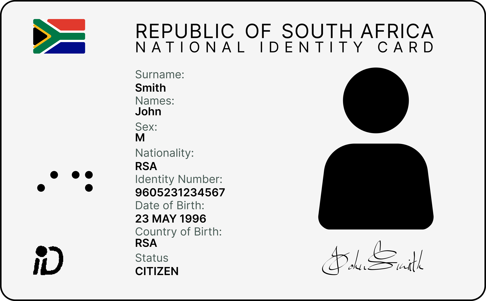

<h3 align="center">Get Verified</h3>

<p align="center">
    Building the future of identity verification for South Africa
    <br />
    <a href="https://getverified.co.za"><strong>Learn more »</strong></a>
    <br />
    <br />
    <a href="#introduction"><strong>Introduction</strong></a> ·
    <a href="#features"><strong>Features</strong></a> ·
    <a href="#get-started"><strong>Get Started</strong></a> ·
    <a href="#contributing"><strong>Contributing</strong></a>
</p>

<p align="center">
  <a href="https://github.com/getverifiedhq/get-verified/blob/main/LICENSE.md">
    
  </a>
</p>

<br/>

## Introduction

This repository provides an open-source model designed to detect security features of South African identity documents.



```json
{
  "surname": "SMITH",
  "names": "JOHN",
  "sex": "MALE",
  "identity_number": "9605231234567",
  "date_of_birth": "1996-05-23",
  "status": "CITIZEN"
}
```

## Features

- **Document Verification**:
  - [ ] ID Book
  - [x] Smart ID Card
  - [ ] Passport
  - [ ] Driving License

## Labels

* **0**: `braille`
* **1**: `flag`
* **2**: `id_design`
* **3**: `identity_card`
* **4**: `identity_number`
* **5**: `image`
* **6**: `names`
* **7**: `signature`
* **8**: `surname`

## Get Started

**Prerequisites**

- Python 3.10
  - Linux: `./install-python.sh`
  - macOS: `brew install python@3.10`
- OpenCV
  - Linux: `apt install -y python3-opencv libopencv-dev`
- Tesseract
  - Linux: `apt-get install -y tesseract-ocr`
  - macOS: `brew install tesseract`

```bash
git clone https://github.com/getverifiedhq/get-verified.git

python3.10 -m venv myenv

source myenv/bin/activate

pip install -r requirements.txt

python src/main.py test.png
```

## Contributing

We love our contributors! Here's how you can contribute:

- [Open an issue](https://github.com/getverifiedhq/get-verified/issues) if you believe you've encountered a bug.
- Make a [pull request](https://github.com/getverifiedhq/get-verified/pull) to add new features/make quality-of-life improvements/fix bugs.

<br />

<a href="https://github.com/getverifiedhq/get-verified/graphs/contributors">
  
</a>

## Repo Activity


## License

Inspired by [Plausible](https://plausible.io/), Get Verified is open-source under the GNU Affero General Public License Version 3 (AGPLv3) or any later version. You can [find it here](https://github.com/getverifiedhq/get-verified/blob/main/LICENSE.md).
